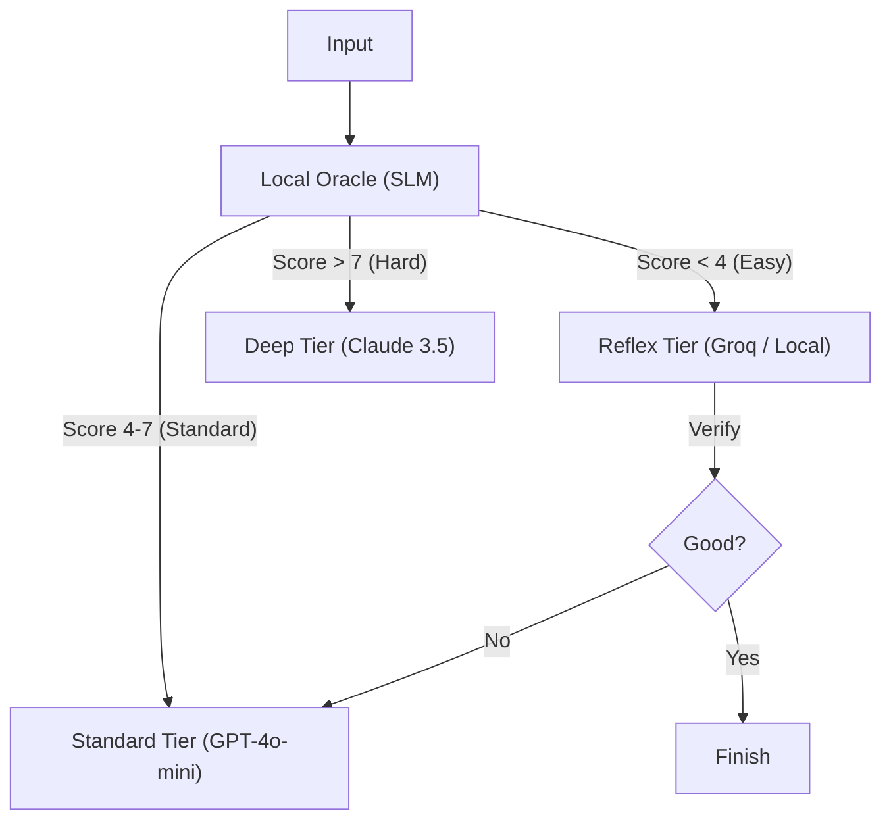
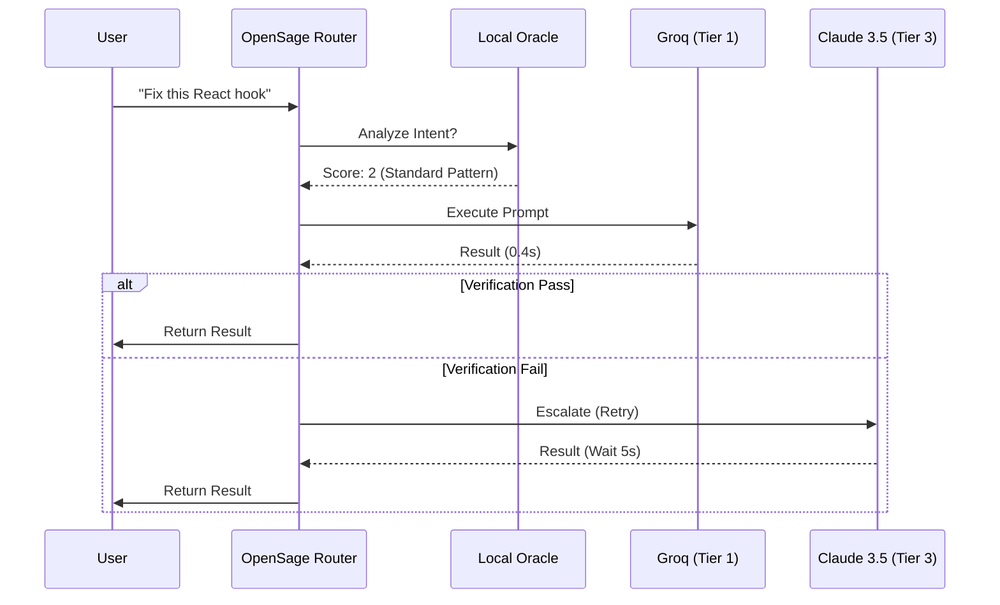

# OpenSage

<div align="center">


<h3>The Nervous System for Autonomous Agents.</h3>

<p style="font-size: 1.2em;">
    <strong>Smart Routing</strong> • <strong>Zero Latency</strong> • <strong>Hardware Sovereignty</strong>
</p>

<p>
    <br />
    <a href="https://aeonsage.org"><strong>Explore AeonSage Pro »</strong></a>
    <br />
    <br />
</p>

</div>

---

**OpenSage** is a production-grade **Cognitive Router** designed to sit between your User and your LLMs. 
It decouples **Intelligence** (Routing) from **Execution** (Inference), allowing you to build agents that are simultaneously **smarter**, **faster**, and **95% cheaper**.

> **"Don't rent intelligence. Own it."**

## Highlights

*   **Local Oracle**: A tiny, specialized SLM (Small Language Model) runs locally to analyze user intent, complexity, and domain *before* any request leaves your machine.
*   **95% Cost Reduction**: Automatically routes "easy" tasks (80% of traffic) to free/cheap models like **Llama 3** (via Groq) or local quantized models.
*   **20x Lower Latency**: Simple queries are answered in **<0.6s** using hardware-accelerated LPU clusters, skipping the 12s+ wait time of GPT-4.
*   **Sovereign Privacy**: Sensitive or trivial data never touches a third-party cloud if you configure local fallbacks.

## The Bill: Reality Check

We ran **1,000 requests** through a standard "GPT-4 Wrapper" vs. an **OpenSage Agent**.

| Line Item | Legacy Agent (All-in GPT-4) | OpenSage (Tiered Routing) |
| :--- | :--- | :--- |
| **Phatic / Chit-Chat** (300 reqs) | $9.00 (GPT-4) | **$0.00** (Local/Groq) |
| **Simple Coding / Refactor** (500 reqs) | $15.00 (GPT-4) | **$0.10** (Llama 3 70B) |
| **Deep Reasoning / Arch** (200 reqs) | $6.00 (GPT-4) | **$6.00** (Claude 3.5 / GPT-4) |
| **Total Cost** | **$30.00** | **$6.10** (-80%) |
| **Avg Latency** | 12.5s | **0.8s** (15x Faster) |

## Installation

```bash
npm install opensage
# or
pnpm add opensage
```

> **Note**: You must have a Local Oracle running.
> **[Read the Setup Guide](./docs/setup.md)** to install Ollama and the required model.

## Quick Start

```typescript
import { CognitiveRouter, providers } from "opensage";

// 1. Configure the Router
const router = new CognitiveRouter({
  oracle: { model: "qwen2.5:0.5b", provider: "ollama" },
  tiers: {
    reflex: ["openrouter:groq/llama-3-8b-8192"], // Tier 1 (Fast)
    standard: ["openai:gpt-4o-mini"],            // Tier 2 (Balanced)
    deep: ["anthropic:claude-3-5-sonnet"]        // Tier 3 (Smart)
  }
});

// 2. Route a Prompt
const prompt = "Can you fix the race condition in this React hook?";
const decision = await router.route(prompt);

console.log(decision);
/* Output:
{
  "tier": "reflex",
  "reason": "Standard coding pattern detected. High complexity logic not required.",
  "target": {
    "provider": "openrouter",
    "model": "groq/llama-3-8b-8192"
  },
  "confidence": 0.92
}
*/
```

## Architecture

OpenSage is built on the **"Optimistic Cascading"** pattern.

### 1. Decision Flow



### 2. Request Lifecycle (Sequence)



*See [Detailed Architecture](./docs/design.md) for deep dive.*
*See [Comparisons](./docs/comparison.md) for OpenSage vs Regex Routers.*

## Ecosystem & Credits

OpenSage is the open-source core of **AeonSage Pro**. It relies on these giants:

*   **[Ollama](https://ollama.com)**: The engine for local inference.
*   **[OpenRouter](https://openrouter.ai)**: The marketplace for unified model access.
*   **[Groq](https://groq.com)**: The hardware enabling sub-second inference.

## For Gateway Builders

Building an **AI Gateway** or **LLM Proxy**?
OpenSage is designed to be the **Intelligent Kernel** inside your infrastructure.

*   **LangChain**: Use OpenSage as a custom `Runnable` router.
*   **Vercel AI SDK**: Plug into `generateText` for dynamic model selection.
*   **Custom Gateways**: Import `CognitiveRouter` to add intelligence to your proxy.

> **Call for PRs**: converting `OpenSage` into a [LangGraph](https://langchain-ai.github.io/langgraph/) node or [Kong Plugin](https://konghq.com)? We want to merge it!

## Contributing

**We want this to be the universal router for everyone.**
Whether you use Next.js, Python, or Go - the logic should be shared.

*   **JavaScript/TypeScript**: Ready today.
*   **Python/Go**: Contributors needed!

**[Read the Contribution Guide](./CONTRIBUTING.md)** to send your first PR.

## License

MIT © [AeonSage Team](https://aeonsage.org)
