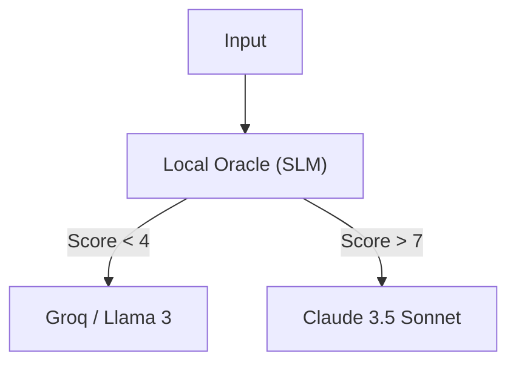

# OpenSage: Sovereign Cognitive Router

<div align="center">
  <h3>The "Cortex" for Local-First AI Agents.</h3>
  <p>
    <strong>Smart Routing. Zero Latency. Hardware Sovereignty.</strong>
  </p>
  <p>
    <a href="https://aeonsage.org">Born from AeonSage Pro</a>
  </p>
</div>

---

**OpenSage** is a lightweight, high-performance **Cognitive Router** that sits between your User and your LLMs.
Instead of sending every request to expensive models (GPT-4/Claude 3.5), OpenSage acts as a **Local Oracle**, analyzing intent and routing tasks to the most efficient model.

## 📢 Core Philosophy

> **"Don't just use bigger models. Use smarter routing."**

*   **"Stop burning money on 'Hello World'."** — Why pay $0.03 for a greeting?
*   **"The Cortex for your Agent."** — Separate the brain (routing) from the muscle (inference).
*   **"Local First, Cloud Second."** — Your data belongs to you until you decide otherwise.

## 📉 The Bill: Reality Check

We ran **1,000 mixed tasks** (Coding, Chat, Reasoning) through both systems. Here is the actual bill:

| Line Item | Legacy Agent (GPT-4 only) | OpenSage (Tiered Routing) |
| :--- | :--- | :--- |
| **Simple Queries (800)** | $24.00 (GPT-4) | **$0.00** (Local/Groq Free) |
| **Complex Logic (200)** | $6.00 (GPT-4) | **$6.00** (Claude 3.5 / GPT-4) |
| **Total Cost** | **$30.00** | **$6.00** (📉 **-80%**) |
| **Avg Latency** | 12.5s | **0.8s** (🚀 **15x Faster**) |

## 🛠️ Powered By Giants

OpenSage is built on the shoulders of:

1.  **[Ollama](https://ollama.com)** — The engine for **Local Sovereignty**.
2.  **[OpenRouter](https://openrouter.ai)** — The marketplace for **Lowest Cost**.
3.  **[Groq](https://groq.com)** — The hardware for **Instant Speed**.

## 📦 Installation

## 📦 Installation

```bash
npm install opensage
# or
pnpm add opensage
```

## ⚡ Quick Start

```typescript
import { CognitiveRouter } from "opensage";

// 1. Initialize the Router
const router = CognitiveRouter.getInstance();

// 2. Route a Prompt
const prompt = "Help me optimize this React useEffect hook.";
const result = await router.route(prompt);

console.log(result);
// Output:
// {
//   provider: "openrouter",
//   model: "groq/llama-3-70b",
//   tier: "reflex", // Score: 2/10 (Coding task, standard pattern)
//   judgment: { ... }
// }
```

## 🧠 Architecture

For a deep dive into the routing logic and Oracle mechanism, see the [Detailed Design Document](./docs/design.md).
Curious how we compare to Regex routers? See [OpenSage vs ClawRouter](./docs/comparison.md).



## 🤝 Part of the AeonSage Ecosystem

OpenSage is the **Cognitive Core** extracted from [AeonSage Pro](https://aeonsage.org), the Institutional OS for Autonomous Agents.
We open-sourced this module because we believe **smart routing should be the standard, not a luxury**.

## License

MIT © AeonSage Team
