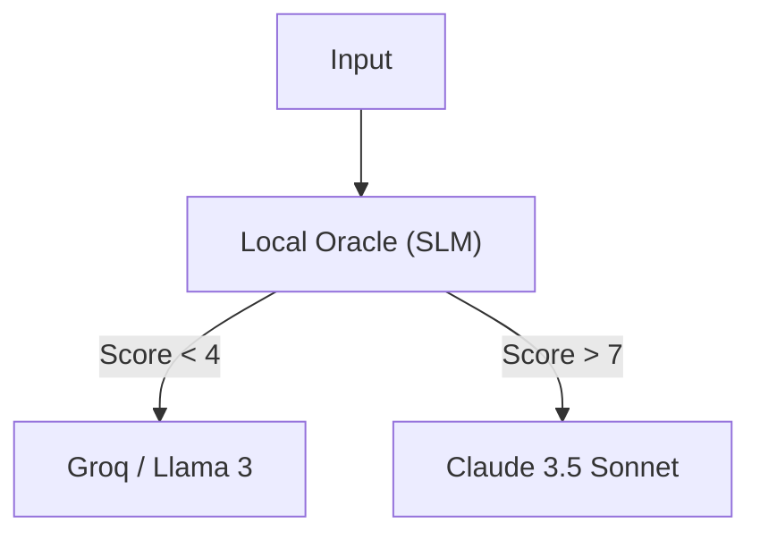

# OpenSage: Sovereign Cognitive Router

<div align="center">
  <h3>The "Cortex" for Local-First AI Agents.</h3>
  <p>
    <strong>Smart Routing. Zero Latency. Hardware Sovereignty.</strong>
  </p>
  <p>
    <a href="https://aeonsage.org">Born from AeonSage Pro</a>
  </p>
</div>

---

**OpenSage** is a lightweight, high-performance **Cognitive Router** that sits between your User and your LLMs.
Instead of sending every request to expensive models (GPT-4/Claude 3.5), OpenSage acts as a **Local Oracle**, analyzing intent and routing tasks to the most efficient model.

## 🚀 Why OpenSage?

| Feature | Description | Benefit |
| :--- | :--- | :--- |
| **Local Oracle** | Uses a tiny SLM (Qwen/Llama) to "vibe check" prompts locally. | **Zero Cost** routing logic. |
| **Optimistic Cascading** | Tries instant models (Groq/Local) first. Escalate only on failure. | **95% Cost Reduction**. |
| **Latency Arbitration** | Routes simple queries to <0.6s LPU clusters. | **20x Speedup** vs GPT-4. |
| **Privacy First** | Basic tasks never leave your local network (if using Ollama). | **Data Sovereignty**. |

## 📦 Installation

```bash
npm install opensage
# or
pnpm add opensage
```

## ⚡ Quick Start

```typescript
import { CognitiveRouter } from "opensage";

// 1. Initialize the Router
const router = CognitiveRouter.getInstance();

// 2. Route a Prompt
const prompt = "Help me optimize this React useEffect hook.";
const result = await router.route(prompt);

console.log(result);
// Output:
// {
//   provider: "openrouter",
//   model: "groq/llama-3-70b",
//   tier: "reflex", // Score: 2/10 (Coding task, standard pattern)
//   judgment: { ... }
// }
```

## 🧠 Architecture

For a deep dive into the routing logic and Oracle mechanism, see the [Detailed Design Document](./docs/design.md).
Curious how we compare to Regex routers? See [OpenSage vs ClawRouter](./docs/comparison.md).



## 🤝 Part of the AeonSage Ecosystem

OpenSage is the **Cognitive Core** extracted from [AeonSage Pro](https://aeonsage.org), the Institutional OS for Autonomous Agents.
We open-sourced this module because we believe **smart routing should be the standard, not a luxury**.

## License

MIT © AeonSage Team
