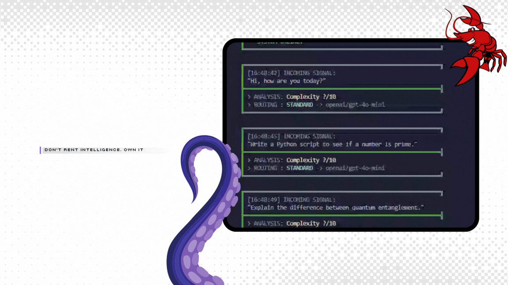

<div align="center">


<h3>The Cognitive Routing Core for LLM Agents</h3>

<p>
  <strong>Intent Analysis -- Tiered Model Selection -- Fail-Open Design</strong>
</p>

<p>
  <a href="docs/design.md">Design</a> |
  <a href="docs/setup.md">Setup</a> |
  <a href="docs/comparison.md">Comparison</a> |
  <a href="docs/integrations.md">Integrations</a> |
  <a href="README_ZH.md">中文文档</a>
</p>

[](./package.json)
[](./LICENSE)
[](./tsconfig.json)
[](https://nodejs.org)
[](https://ollama.com)
[](https://openrouter.ai)

</div>


<br>



<br>

---

## ● What OpenSage Does

OpenSage is a **routing decision engine**. It does not execute LLM calls itself — it tells your agent **which model to use** for a given prompt.

It works by running a local Small Language Model (the "Oracle") to semantically analyze each user prompt, then returning a structured routing decision containing the recommended provider, model ID, and tier.

**What is implemented today (~214 lines of TypeScript):**

- **Oracle Engine** — Calls a local Ollama instance (qwen2.5:0.5b) to classify prompts by complexity (1-10), domain, and suggested tier. Strict 500ms timeout with fail-open behavior.
- **Tier Decision** — Maps Oracle output to three tiers: Reflex (score 1-3), Standard (4-7), Deep (8-10). Falls back to Standard if Oracle is offline.
- **Model Resolution** — Returns the first candidate model ID for the selected tier from a hardcoded mapping table.
- **Provider Parsing** — Splits `provider:model` strings (e.g. `openrouter:groq/llama-3-8b-8192`) into separate provider and model fields.

**What is NOT yet implemented:**

- Output verification and automatic tier escalation (the "cascading retry" shown in design docs)
- Actual model execution — OpenSage returns a decision, your agent framework handles the call
- Dynamic model availability checking
- Configuration via environment variables
- CLI tool, plugin system, cost tracking

---

## ● How It Works


```mermaid
   graph TD
    %% Cyber-Sage Theme
    classDef user fill:#000000,stroke:#66ff66,stroke-width:2px,color:#ffffff,rx:10,ry:10;
    classDef core fill:#000000,stroke:#39ff14,stroke-width:2px,color:#ffffff,rx:10,ry:10;
    classDef tier fill:#000000,stroke:#66ff66,stroke-width:2px,color:#ffffff,rx:5,ry:5;
    classDef logic fill:#000000,stroke:#99ff99,stroke-width:2px,color:#ffffff,stroke-dasharray: 5 5,rx:5,ry:5;
    linkStyle default stroke:#66ff66,stroke-width:2px;

    User(["User Prompt"]):::user --> Ingest
    
    subgraph Velonlabs ["Velonlabs Cognitive Kernel"]
        direction TB
        style Velonlabs fill:#111111,stroke:#66ff66,stroke-width:2px,color:#66ff66
        Ingest[("Ingestion")]:::logic --> Oracle
        Oracle{{"Local Oracle\n(qwen2.5:0.5b)"}}:::core
        
        Oracle == Analysis ==> Router(("Synapse\nrouter")):::logic
    end

    Router -->|Reflex (1-3)| T1["Tier 1: Reflex\n(Groq / Llama-3)"]:::tier
    Router -->|Standard (4-7)| T2["Tier 2: Standard\n(GPT-4o-mini)"]:::tier
    Router -->|Deep (8-10)| T3["Tier 3: Deep\n(Claude 3.5 Sonnet)"]:::tier

    T1 -.->|Verification| AutoCheck{"Quality Check"}:::logic
    AutoCheck -->|Fail| T2
    AutoCheck -->|Pass| Output

    T2 --> Output
    T3 --> Output([("Final Response")]):::user
```

The Oracle is fail-open: if Ollama is not running or times out, the router defaults to Standard tier. This ensures OpenSage never blocks your agent pipeline.

---

## ● Cost Rationale

The value proposition is straightforward: most LLM traffic does not need GPT-4.

| Request Type | Typical Mix | Without Routing | With Routing |
| :--- | :---: | :--- | :--- |
| Greetings, chit-chat | ~30% | GPT-4 ($0.03/req) | Local/Groq ($0.00) |
| Standard coding | ~50% | GPT-4 ($0.03/req) | Llama 3 via Groq ($0.0002/req) |
| Complex reasoning | ~20% | GPT-4 ($0.03/req) | Claude 3.5 ($0.03/req) |

Estimated savings: **~80%** on a mixed workload. Actual results depend on your traffic distribution and provider pricing.

---

## ● Prerequisites (Critical)

Before running OpenSage, you **must** have the Local Oracle running.

Please follow our [Setup Guide](docs/setup.md) to install Ollama and the required model.

OpenSage relies on this local model (`qwen2.5:0.5b`) to make intelligent routing decisions without API costs.

---

## ● Quick Start

```bash
git clone https://github.com/Vleonone/Opensage.git
cd Opensage
npm install
```

```typescript
import { CognitiveRouter } from "./src/router.js";

const router = CognitiveRouter.getInstance();
const result = await router.route("Fix the race condition in this React hook");

// result = {
//   provider: "openrouter",
//   model: "groq/llama-3-8b-8192",
//   tier: "reflex",
//   judgment: { complexity: 3, reasoning_required: false, domain: "coding", suggested_tier: "reflex" }
// }
```

Run the demo:

```bash
npx ts-node examples/demo.ts
```

## ● Running the Project

### 1. Terminal UI (TUI) Dashboard
The best way to experience OpenSage. Displays a real-time, "hacker-style" interface with live routing logs.

```bash
# Run the TUI (includes build)
npm run gui
```

### 2. Simple Demo Script
Runs the basic demo script via `ts-node` (development mode).

```bash
npx ts-node examples/demo.ts
```

### 3. Build for Production
To compile the TypeScript project into the `dist` directory:

```bash
npm run build
```

The compiled files can be run directly with node:
```bash
node dist/tui_demo.js
```

---

## ● Integration Guide

OpenSage is a pure routing layer. It returns a model selection decision — your agent framework uses that decision to make the actual LLM call. This makes it compatible with **any** agent system that allows you to choose which model to call.

### Integration with AeonsagePro

OpenSage was extracted from AeonsagePro. In the Pro codebase, integration happens at `src/commands/agent.ts`:

```typescript
// Intercept before the default model is used
if (!sessionEntry?.modelOverride && !opts.model) {
    const { CognitiveRouter } = await import("../cognitive-router/router.js");
    const router = CognitiveRouter.getInstance();
    const routeResult = await router.route(userMessage);

    provider = routeResult.provider;  // e.g. "openrouter"
    model = routeResult.model;        // e.g. "groq/llama-3-8b-8192"
}
// Then proceed with the selected provider/model...
```

The pattern is: intercept before your default model selection, call `router.route()`, use the returned `provider` and `model` to override your defaults.

### Integration with OpenClaw / Other Agent Frameworks

Any agent gateway that lets you dynamically select a model can integrate OpenSage. The pattern is identical:

```typescript
import { CognitiveRouter } from "opensage/src/router.js";

// In your agent's message handler:
async function handleMessage(userPrompt: string) {
    const router = CognitiveRouter.getInstance();
    const decision = await router.route(userPrompt);

    // Use the decision to configure your LLM call
    // The exact API depends on your framework:

    // -- OpenClaw example --
    // const response = await claw.chat({
    //     provider: decision.provider,
    //     model: decision.model,
    //     messages: [{ role: "user", content: userPrompt }]
    // });

    // -- LangChain example --
    // const llm = new ChatOpenAI({ modelName: decision.model });
    // const response = await llm.invoke(userPrompt);

    // -- Vercel AI SDK example --
    // const result = await generateText({
    //     model: openai(decision.model),
    //     prompt: userPrompt
    // });

    // -- Direct OpenRouter API --
    // const response = await fetch("https://openrouter.ai/api/v1/chat/completions", {
    //     method: "POST",
    //     headers: { "Authorization": `Bearer ${OPENROUTER_KEY}` },
    //     body: JSON.stringify({ model: decision.model, messages: [...] })
    // });
}
```

### Adapting the Tier Model Map

The default model mapping is in `src/routing/cascading.ts`. To match your provider setup:

```typescript
// Current defaults:
export const TIER_MODEL_MAP = {
    reflex:   ["openrouter:groq/llama-3-8b-8192", "ollama:qwen2.5:0.5b"],
    standard: ["gpt-4o-mini", "claude-3-haiku"],
    deep:     ["claude-3-5-sonnet-20240620", "gpt-4o"],
};

// Customize for your setup — e.g. if you only use OpenRouter:
export const TIER_MODEL_MAP = {
    reflex:   ["openrouter:meta-llama/llama-3-70b"],
    standard: ["openrouter:openai/gpt-4o-mini"],
    deep:     ["openrouter:anthropic/claude-3.5-sonnet"],
};
```

---

## ● Project Structure

```
src/
  router.ts              -- CognitiveRouter (singleton, entry point)
  oracle/
    engine.ts            -- OracleEngine (local SLM classification via Ollama)
  routing/
    cascading.ts         -- CascadingRouter (tier decision + model resolution)
docs/
  design.md              -- Full technical design document
  setup.md               -- Ollama installation guide
  comparison.md          -- Cognitive routing vs regex routing
  integrations.md        -- Ecosystem integrations (Mem0, MCP, ChromaDB)
examples/
  demo.ts                -- Runnable demo script
```

---

## ● Roadmap

- Output verification and automatic tier escalation (cascading retry)
- Environment variable configuration for Oracle URL, model, and timeout
- Plugin system for custom routing logic
- Built-in cost tracking and token accounting
- Standalone CLI tool
- NPM package publication
- Python port

---

## ● Contributing

See [CONTRIBUTING.md](./CONTRIBUTING.md). We welcome pull requests for:

- New provider adapters (Google Gemini, Azure, Mistral)
- Oracle model benchmarks (Phi-3, Gemma-2b)
- Framework integration adapters (LangChainJS, Vercel AI SDK)

---

## ● Ecosystem

OpenSage is the open-source routing core of [AeonsagePro](https://github.com/velonone/Aeonsagepro). It relies on:

- [Ollama](https://ollama.com) — Local inference engine
- [OpenRouter](https://openrouter.ai) — Unified model marketplace
- [Groq](https://groq.com) — Sub-second inference hardware

---

## ● License

MIT - [AeonSage Team](https://aeonsage.org)
