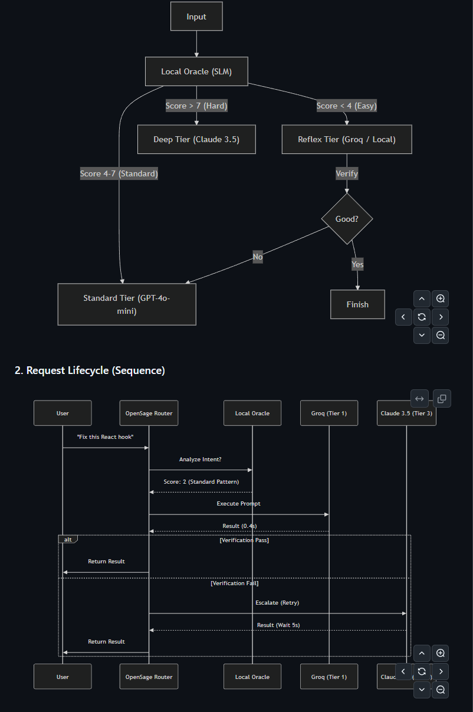

<div align="center">


<h3>LLM Agent 的认知路由核心</h3>

<p>
  <strong>意图分析 -- 分级模型选择 -- 故障开放设计</strong>
</p>

<p>
  <a href="docs/design.md">设计文档</a> |
  <a href="docs/setup.md">安装指南</a> |
  <a href="docs/comparison.md">竞品对比</a> |
  <a href="docs/integrations.md">生态集成</a> |
  <a href="README.md">English Doc</a>
</p>

[](./LICENSE)
[](./tsconfig.json)
[](https://nodejs.org)

</div>

---

## OpenSage 是什么

OpenSage 是一个**路由决策引擎**。它本身不执行 LLM 调用，而是告诉你的 Agent **"对于这句话，应该用哪个模型"**。

它的核心理念是：**不要盲目地把所有请求都发给昂贵的 GPT-4。** 

OpenSage 会运行一个本地的微型模型 ("Oracle") 来语义分析每条用户指令的意图和复杂度，然后返回一个结构化的路由决策（包含推荐的厂商、模型ID、分级）。

**当前版本已实现的功能 (~214 行 TypeScript):**

- **Oracle 引擎** — 调用本地 Ollama (qwen2.5:0.5b) 对 Prompt 进行 1-10 级复杂度评分、领域分类。拥有严格的 500ms 超时控制。
- **分级决策** — 将 Oracle 评分映射为三个层级：Reflex (1-3分), Standard (4-7分), Deep (8-10分)。
- **模型解析** — 针对层级返回具体的模型 ID（如 `openrouter:groq/llama-3-8b-8192`）。
- **故障开放 (Fail-Open)** — 如果本地 Oracle 宕机或超时，系统会自动降级到 Standard 层，确保业务不中断。

**当前版本尚未实现的功能:**

- 自动验证输出并重试（设计文档中的 "Cascading Retry"）
- 实际的模型推理执行（OpenSage 仅返回决策，需配合 Agent 框架使用）
- 动态模型可用性检测
- CLI 工具与插件系统
- 成本统计

---

## 工作原理



---

## 竞品对比：OpenSage vs ClawRouter

**ClawRouter** (https://github.com/BlockRunAI/ClawRouter) 是另一个优秀的路由方案。两者的核心区别在于**路由逻辑**。

| 维度 | ClawRouter | OpenSage |
| :--- | :--- | :--- |
| **路由原理** | **正则关键词匹配 (Regex)** | **语义认知理解 (Cognitive)** |
| **判断方式** | "如果包含 '画图' 则用 A 模型" | "分析用户意图复杂度，按需分配算力" |
| **优势** | 极速 (微秒级)、配置简单、确定性高 | 灵活、能理解模糊指令、能判断任务难易 |
| **劣势** | 机械死板，无法处理未定义的表达 | 需运行本地模型，有约 400ms 延迟 |
| **适用场景** | 明确的指令系统、工具调用路由 | 自然语言对话、混合任务处理、成本优化 |

**结论**：
- 如果构建**指令型 Bot**（如 Discord Bot），ClawRouter 更轻量高效。
- 如果构建**智能 Agent**（如 AeonsagePro），需要根据问题难易度智能省钱，OpenSage 是更好的选择。

---

## 集成指南

OpenSage 返回决策，你的 Agent 框架负责执行。

### 对接 AeonsagePro

OpenSage 是 AeonsagePro 的核心组件。在 Pro 版代码中，集成逻辑位于 `src/commands/agent.ts`：

```typescript
// 在使用默认模型前进行拦截
if (!sessionEntry?.modelOverride && !opts.model) {
    // 动态加载路由模块
    const { CognitiveRouter } = await import("../cognitive-router/router.js");
    const router = CognitiveRouter.getInstance();
    
    // 获取路由决策
    const routeResult = await router.route(userMessage);

    // 使用决策覆盖默认模型
    provider = routeResult.provider;  // 例如 "openrouter"
    model = routeResult.model;        // 例如 "groq/llama-3-8b-8192"
}
// 随后使用选定的 provider/model 执行请求...
```

### 对接其他 Agent (如 OpenClaw / LangChain)

OpenSage 可作为前置中间件集成。

```typescript
import { CognitiveRouter } from "opensage/src/router.js";

async function handleUserMessage(prompt) {
    // 1. 获取决策
    const router = CognitiveRouter.getInstance();
    const decision = await router.route(prompt);
    
    console.log(`OpenSage 建议使用: ${decision.model}`);

    // 2. 执行调用 (以 LangChain 为例)
    // const llm = new ChatOpenAI({ modelName: decision.model });
    // const response = await llm.call(prompt);
}
```

---

## 快速开始

### 1. 准备环境

- Node.js >= 18
- [Ollama](https://ollama.com) (运行本地 Oracle)

安装并拉取模型：
```bash
ollama pull qwen2.5:0.5b
```

### 2. 安装与运行

```bash
git clone https://github.com/Vleonone/Opensage.git
cd Opensage
npm install

# 运行演示脚本
npx ts-node examples/demo.ts
```

---

## 许可证

MIT - [AeonSage Team](https://aeonsage.org)
