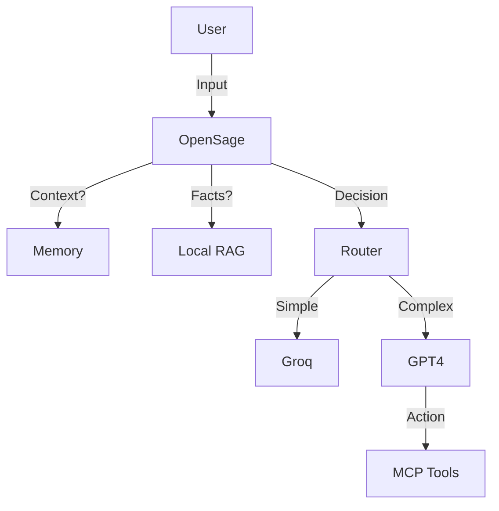

# 🧩 The Intelligence Stack: Making OpenSage Smarter

OpenSage is designed as a **Modular Orchestrator**. It doesn't force you to use specific tools, but it binds the best open-source components into a cohesive system.

These are **independent, industry-standard projects** that OpenSage natively integrates with to form a "Super-Agent":

## 1. Memory (The Hippocampus)
*Give your router long-term context.*

*   **[Mem0](https://github.com/mem0ai/mem0)** (Highly Recommended)
    *   **Why**: Self-improving memory that learns user preferences over time.
    *   **Synergy**: OpenSage can route based on *who* the user is (e.g., "User is a Junior Dev" -> Route to explanatory model).

## 2. Tools & Data (The Hands)
*Standardize how your agent connects to the world.*

*   **[Model Context Protocol (MCP)](https://modelcontextprotocol.io/)**
    *   **Why**: The new standard for connecting AI to data sources (Files, GitHub, Slack).
    *   **Synergy**: Use OpenSage to decide *which* MCP server to query before routing.

## 3. RAG / Vector Store (The Library)
*Give your router access to your private docs.*

*   **[ChromaDB](https://www.trychroma.com/)** (Local)
    *   **Why**: Open-source, runs locally, fits the "Sovereign" ethos perfectly.
    *   **Synergy**: Query Chroma *inside* the Oracle Phase to route based on document availability.

## 4. Observability (The Eyes)
*See why the router made a decision.*

*   **[Helicone](https://www.helicone.ai/)**
    *   **Why**: Open-source LLM observability.
    *   **Synergy**: Log every OpenSage decision to dashboard. "Why did it route to GPT-4?" -> Check Helicone logs.

## Example: The "Super-Agent" Architecture

