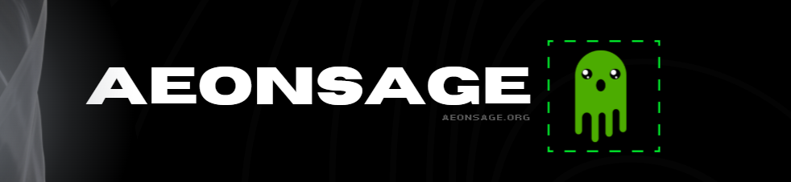

<div align="center">



# OPENSAGE: THE COGNITIVE KERNEL

**The Reference Implementation of Sovereign Intelligence**

**Architected by VelonLabs 路 Powered by AeonSage**

<p>
  <a href="https://aeonsage.org">Official Site</a> 鈥?  <a href="https://docs.aeonsage.org">Kernel Documentation</a>
</p>

[](./LICENSE)

</div>

---

## 1. Kernel Abstract

**OpenSage** is the **Cognitive Runtime Environment (CRE)** extracted from the AeonSage OS. It serves as the local-first decision engine for autonomous agents.

Unlike simplified "router" libraries, OpenSage is a **Deterministic Substrate** that enforces:
1.  **Entropy Reduction**: Routing logic based on task complexity, not just model availability.
2.  **Identity Assertion**: Every cognitive action is cryptographically signed.
3.  **Sovereign Execution**: Prefers local inference (Ollama/Llama3) over cloud APIs when possible.

## 2. Technical Specifications

### 2.1 The Routing Matrix (Optimistic Cascading)
The kernel implements a tiered logic system to optimize Cognitive Economics.

| Matrix Tier | Model Class | Task Type | Throughput |
| :--- | :--- | :--- | :--- |
| **Reflex (T1)** | Local SLM (7B) | Formatting, JSON Repair | **< 10ms** |
| **Reasoning (T2)**| GPT-4o-mini | Logic, Planning | ~600ms |
| **Synthesis (T3)**| Claude 3.5 Sonnet | Code Generation | ~4000ms |

### 2.3 Ecosystem Integration Matrix

OpenSage acts as the **Connective Tissue** between these sovereign technologies.
> **USER GUIDE**: For detailed operation of the Neural Uplink, refer to the [Sovereign Cognitive Kernel Manual](../docs/sovereign-kernel.md).

| COMPONENT | TECHNOLOGY | ROLE |
| :--- | :--- | :--- |
| **CORE ENGINE** |   | Execution & Inference |
| **MEMORY** |   | Semantic Retrieval |
| **ORCHESTRATION** |   | Process Management |
| **ACCELERATION** |  | Low-Latency Token Generation |

> **ARCHITECTURE NOTE**: This matrix represents the *validated* stack. OpenSage is agnostic but optimized for these specific vector/inference pairs.

// Initialize the Sovereign Runtime
const kernel = new CognitiveKernel({
  uplink: process.env.NEURAL_UPLINK_TOKEN,
  sovereignty: 'local-first'
});

// Execute a signed cognitive task
const decision = await kernel.execute({
  intent: 'analyze_market_entropy',
  context: { system_load: 0.45 }
});
```

---

<div align="center">
  <sub><strong>EST. 2025 路 VELONLABS RESEARCH 路 MIT LICENSE</strong></sub>
</div>
